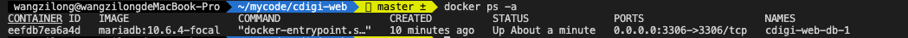

# cdigi-web

由于需要支持本地部署，所以采用 docker-compose 的方式，rush 对于 docker-compose 的集成不是很友好，rush 会整体生成一个 pnpm-lock.yaml，在做 docker-compose 的时候需要进行拆分，这个没办法做到，于是选择放弃 rush

## 项目启动

切换到每个项目中

```bash
yarn
yarn start:dev
yarn start:debug
```

## 代码管理

代码仓库管理采用 monorepo 的方式，主要使用 [rush](https://rushjs.io/zh-cn/pages/intro/get_started/) + [pnpm](https://pnpm.io/zh/installation) 的方案

### 服务端

[nestjs](https://docs.nestjs.com/first-steps 'nestjs') 框架（[中文文档](https://docs.nestjs.cn/8/firststeps?id=%e8%bf%90%e8%a1%8c%e5%ba%94%e7%94%a8%e7%a8%8b%e5%ba%8f)）

ORM 框架使用 [typeorm](https://typeorm.io/migrations)（[中文文档](https://typeorm.biunav.com/zh/#%E5%AE%89%E8%A3%85)）

### 客户端

[ant-design-pro](https://pro.ant.design/zh-CN/docs/getting-started/ 'nestjs') 框架（主要是 [umi3](https://v3.umijs.org/zh-CN/docs/getting-started) 那一套）

## 部署

采用 [docker-compose](https://docs.docker.com/compose/) （[中文文档](https://vuepress.mirror.docker-practice.com/compose/commands/#top)）的方案进行整合部署

参考 [awesome-compose](https://github.com/docker/awesome-compose)

### 启动容器

```bash
docker compose up -d
```

- `-d` 在后台运行服务容器。
- `--no-color` 不使用颜色来区分不同的服务的控制台输出。
- `--no-deps` 不启动服务所链接的容器。
- `--force-recreate` 强制重新创建容器，不能与 `--no-recreate` 同时使用。
- `--no-recreate` 如果容器已经存在了，则不重新创建，不能与 `--force-recreate` 同时使用。
- `--build` 在启动容器之前先进行镜像构建，即使已存在也会进行构建。
- `--no-build` 不自动构建缺失的服务镜像。
- `-t, --timeout TIMEOUT` 停止容器时候的超时（默认为 10 秒）

### 停止容器

```bash
docker compose down
```

### 查看容器

```bash
docker ps -a
```



### 进入容器

```bash
docker exec -it eefdb7ea6a4d bash
docker exec -it eefdb7ea6a4d //bin//sh
```

### 查看 volumes 存放的文件

```
docker run -it --privileged --pid=host debian nsenter -t 1 -m -u -n -i sh
```

### 首次 push 前需要 tag

```
docker tag 923d76f1eba0 wangzilong8/cdigi-web_client
docker tag de177052e2ab wangzilong8/cdigi-web_server
```

### push 镜像

```
docker compose push
```

### windows 中如何限制 docker 占用的最大内存

参考 [wslconf](https://docs.microsoft.com/zh-cn/windows/wsl/wsl-config#wslconf)

docs/windows 中如何限制 docker 占用的最大内存.doc

### 脚本

```
ssh -p 9999 webdev@129.226.182.137
AeTuspV33sdf49dDSDI

scp -P 9999 -r cdigi webdev@129.226.182.137:/home/webdev
AeTuspV33sdf49dDSDI
```
